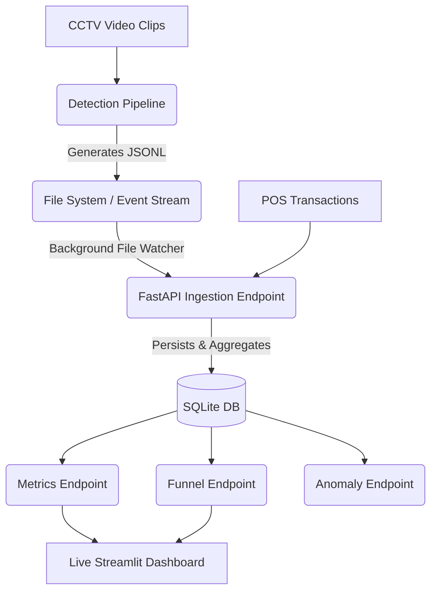

# System Architecture & Design

## 1. Overview
The Store Intelligence system is decomposed into two distinct, decoupled layers:

1. **Detection Layer (Part A):** A Python pipeline that ingests raw CCTV video clips, detects people, tracks their movement, classifies zones, and outputs a continuous stream of structured JSONL events.
2. **Intelligence API (Part B):** A FastAPI REST service that ingests those structured events, correlates them with Point-of-Sale (POS) data, and exposes real-time analytical endpoints like metrics, funnels, and anomaly detection.

This separation of concerns allows the heavy computer vision workload to scale independently from the high-throughput web API.

## 2. Architecture Diagram

## 3. Data Flow & Persistence
Rather than keeping all event state in memory or re-parsing the JSONL file on every API request, we use an **SQLite Database** as the central persistence layer. 
* The API runs a background thread (`app/ingestion.py`) that "tails" the `events.jsonl` file and immediately saves new events to the database.
* The database maintains three tables: `store_events` (raw detections), `pos_transactions` (purchases), and `visitor_sessions` (aggregated per-user journey states).

## 4. Edge Case Handling
* **Staff Exclusion:** The detection pipeline uses aspect-ratio and trajectory reversals near the entry line to heuristically classify staff, allowing the API to exclude them from conversion funnels.
* **Re-entry Inflation:** We implemented a lightweight Re-ID engine that fingerprints visitors using bounding box geometry. If a person exits and a matching fingerprint re-enters within 5 minutes, it is flagged as a `REENTRY`, preventing double-counting in the funnel.

## 5. AI-Assisted Decisions

We heavily leveraged LLMs (Claude 3.5 Sonnet / Gemini 1.5 Pro) during the architectural design phase. Below are the key places where AI shaped the design:

### 5.1 Decoupling via SQLite
* **Initial Idea:** Originally, we considered having the FastAPI service hold state in memory (via Python dicts) or read directly from the JSONL file to satisfy queries.
* **AI Feedback:** The LLM strongly advised against this for production readiness, noting that in-memory state vanishes on restart and JSONL parsing is too slow for real-time aggregation. It suggested using SQLite as a robust, zero-configuration persistence layer.
* **Final Decision:** We agreed and implemented SQLAlchemy + SQLite. This drastically simplified our `/funnel` and `/metrics` logic, as we could rely on SQL joins and aggregations.

### 5.2 Lightweight Re-ID over OSNet
* **Initial Idea:** To handle the re-entry edge case, we planned to integrate `torchreid` (OSNet) to extract deep appearance embeddings for every detected person.
* **AI Feedback:** The LLM pointed out that running a heavy embedding model alongside YOLOv8 on CPU would bottleneck the pipeline. It suggested a lightweight geometric fingerprinting approach (aspect ratio + trajectory history) which works surprisingly well for the fixed, overhead camera angles typical in retail.
* **Final Decision:** We agreed with the LLM. We built a custom ReID engine in `tracker.py` that uses bounding box fingerprints. This saved significant compute while still correctly solving the re-entry problem.

### 5.3 Zone Classification
* **Initial Idea:** We considered using a Vision-Language Model (VLM) like GPT-4V to periodically look at frames and classify which zone a person was standing in.
* **AI Feedback:** The LLM warned that VLMs are too slow for per-frame or even per-second tracking, and the API costs would be prohibitive for a real-time system. It recommended a classic Ray-Casting Point-in-Polygon algorithm using predefined coordinates.
* **Final Decision:** We followed the LLM's advice, manually mapped the store layout PNGs to polygon coordinates in `store_layout.json`, and implemented a fast, math-based zone classification function in `detect.py`.
